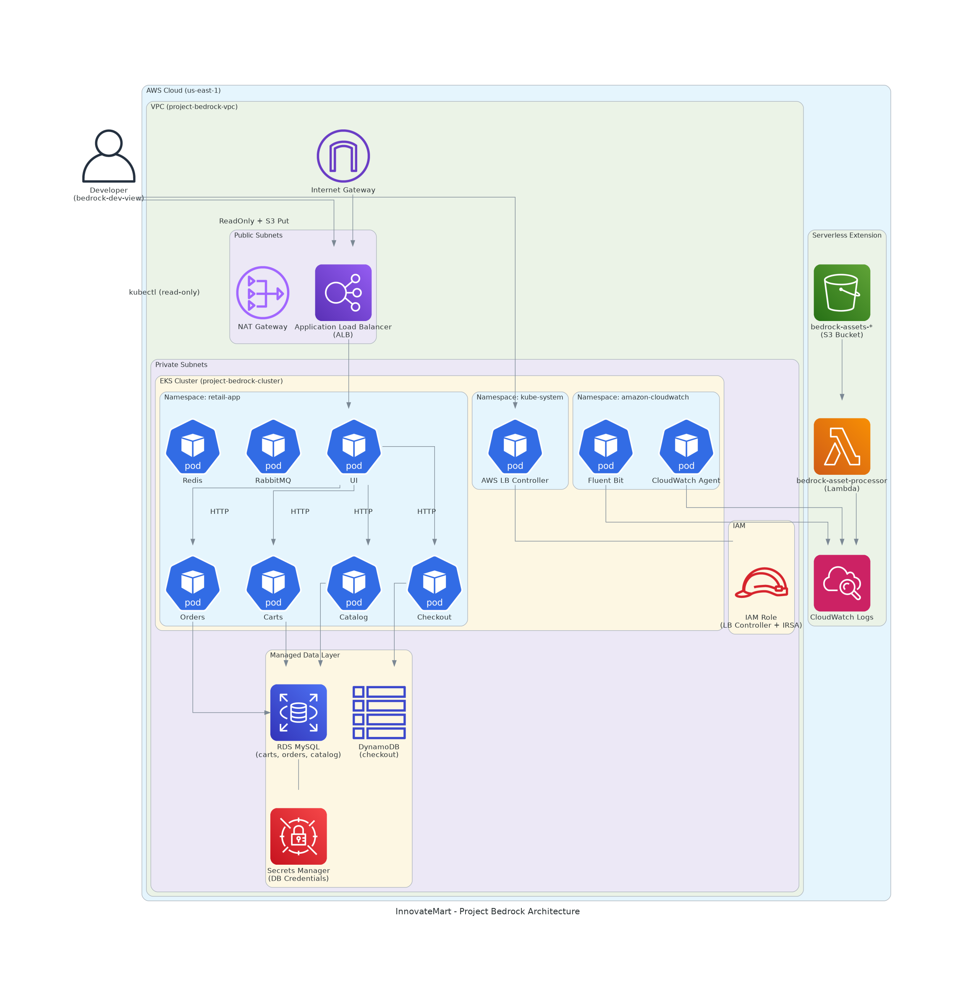

# 🏗️ Architecture - Project Bedrock

**InnovateMart Retail Store on AWS EKS**

---

## High-Level Architecture Diagram



---

## Architecture Overview

Project Bedrock implements a production-grade microservices architecture on AWS EKS for InnovateMart's Retail Store application. The architecture follows AWS best practices with a focus on security, scalability, and observability.

---

## Component Breakdown

### 1. Networking Layer (VPC)

| **Component** | **Details** |
|-----------|---------|
| **VPC** | `project-bedrock-vpc` (10.0.0.0/16) |
| **Availability Zones** | 2 (us-east-1a, us-east-1b) |
| **Public Subnets** | 2 (for ALB and NAT Gateway) |
| **Private Subnets** | 2 (for EKS, RDS, and application workloads) |
| **Internet Gateway** | 1 (public internet access) |
| **NAT Gateway** | 1 (outbound access for private subnets) |

**Design Decisions:**
- Public subnets only host the ALB and NAT Gateway
- All application workloads run in private subnets
- NAT Gateway enables pods to pull images and access AWS APIs
- Multi-AZ deployment for high availability

---

### 2. Compute Layer (EKS)

| **Component** | **Details** |
|-----------|---------|
| **Cluster** | `project-bedrock-cluster` (v1.34) |
| **Node Group** | `project-bedrock-node-group` |
| **Instance Type** | `t3.small` (2 vCPU, 2 GiB) |
| **Node Count** | 3 (min 2, max 5) |
| **Pod Capacity** | ~33 pods (11 per node) |

**Kubernetes Namespaces:**

| **Namespace** | **Purpose** |
|-----------|---------|
| `retail-app` | Application microservices |
| `amazon-cloudwatch` | Observability (FluentBit, CloudWatch Agent) |
| `kube-system` | System components (LB Controller, CoreDNS, kube-proxy) |

---

### 3. Application Layer (Microservices)

| **Service** | **Chart** | **Database** | **In-Cluster** | **Managed** |
|---------|-------|----------|------------|---------|
| **UI** | `./retail-store-app-charts/ui/chart/` | N/A | N/A | N/A |
| **Carts** | `./retail-store-app-charts/cart/chart/` | MySQL | ❌ | ✅ RDS |
| **Catalog** | `./retail-store-app-charts/catalog/chart/` | MySQL | ❌ | ✅ RDS |
| **Orders** | `./retail-store-app-charts/orders/chart/` | MySQL | ❌ | ✅ RDS |
| **Checkout** | `./retail-store-app-charts/checkout/chart/` | DynamoDB | ❌ | ✅ DynamoDB |
| **RabbitMQ** | Static manifest | N/A | ✅ | N/A |
| **Redis** | Static manifest | N/A | ✅ | N/A |

**Design Decisions:**

- All services deployed via Helm charts (bonus objective)
- In-cluster databases (MySQL, PostgreSQL, DynamoDB) replaced with managed AWS services
- Message broker (RabbitMQ) and cache (Redis) run in-cluster (allowed)
- Helm values override in `kubernetes/helm/values.yaml` points to RDS endpoints

---

### 4. Data Layer

| **Service** | **Type** | **Endpoint** | **Engine** |
|---------|------|----------|--------|
| **RDS MySQL** | Managed | `project-bedrock-mysql.*.rds.amazonaws.com:3306` | MySQL 8.0 |
| **RDS PostgreSQL** | Managed | `project-bedrock-postgresql.*.rds.amazonaws.com:5432` | PostgreSQL 15 |
| **DynamoDB** | Managed | `project-bedrock-retail-store` | DynamoDB |

**Security:**

- RDS instances in private subnets
- Security groups restrict access to EKS node/pod CIDR only
- Credentials stored in AWS Secrets Manager
- Secrets injected via environment variables

---

### 5. Ingress & Load Balancing

| **Component** | **Details** |
|-----------|---------|
| **Ingress Controller** | AWS Load Balancer Controller v2.7.0 |
| **Load Balancer** | Application Load Balancer (ALB) |
| **Scheme** | Internet-facing |
| **Target Type** | IP (direct pod addressing) |
| **Listener** | HTTP on port 80 |

**Flow:**

Internet → ALB (Public Subnet) → Ingress → UI Service → UI Pod (Private Subnet)

---

### 6. Security Layer

#### IAM Roles

| **Role** | **Purpose** | **Policies** |
|------|---------|----------|
| `project-bedrock-eks-cluster-role` | EKS cluster management | `AmazonEKSClusterPolicy`, `AmazonEKSVPCResourceController` |
| `project-bedrock-eks-node-role` | Node operations | `AmazonEKSWorkerNodePolicy`, `AmazonEKS_CNI_Policy`, `AmazonEC2ContainerRegistryReadOnly`, `CloudWatchAgentServerPolicy` |
| `project-bedrock-lb-controller-role` | LB controller (IRSA) | Custom inline policy (ELB, EC2, IAM) |
| `bedrock-asset-processor-role` | Lambda execution | `AWSLambdaBasicExecutionRole` |

#### Kubernetes RBAC

| **Binding** | **Role** | **Subject** |
|---------|------|---------|
| `bedrock-dev-view-binding` | `view` (ClusterRole) | `bedrock-dev-view` IAM user |
| `aws-load-balancer-controller` | Custom ClusterRole | LB controller ServiceAccount |

#### Developer Access

| **Access Level** | **Details** |
|--------------|---------|
| **AWS Console** | `ReadOnlyAccess` + `s3:PutObject` on assets bucket |
| **Kubernetes** | `view` ClusterRole (read-only across cluster) |
| **S3** | Upload files to `bedrock-assets-*` bucket |

---

### 7. Observability Layer

| **Component** | **Type** | **Details** |
|-----------|------|---------|
| **Control Plane Logs** | EKS Feature | API, Audit, Authenticator, ControllerManager, Scheduler |
| **FluentBit** | DaemonSet | Container log collection (1 per node) |
| **CloudWatch Agent** | DaemonSet | Metrics collection (1 per node) |
| **Controller Manager** | Deployment | Add-on management |

**Log Groups:**

| **Log Group** | **Source** |
|-----------|--------|
| `/aws/eks/project-bedrock-cluster/cluster` | EKS control plane |
| `/aws/containerinsights/project-bedrock-cluster/application` | Container logs |
| `/aws/containerinsights/project-bedrock-cluster/performance` | Performance metrics |
| `/aws/lambda/bedrock-asset-processor` | Lambda function |

---

### 8. Serverless Extension

| **Component** | **Details** |
|-----------|---------|
| **S3 Bucket** | `bedrock-assets-YOUR-STUDENT-ID` |
| **Lambda Function** | `bedrock-asset-processor` (Python 3.11) |
| **Trigger** | S3 Event Notification (`s3:ObjectCreated:*`) |

**Flow:**

S3 Upload → Event Notification → Lambda → CloudWatch Logs

**Lambda Code:**

```python
def handler(event, context):
    bucket = event['Records'][0]['s3']['bucket']['name']
    key = event['Records'][0]['s3']['object']['key']
    print(f"Image received: {key}")
    return {'statusCode': 200, 'body': f'Successfully processed {key}'}
```

---

### 9. CI/CD Pipeline
| **Workflow** | **Trigger** | **Action** |
|-----------|------|---------|  
| **Terraform Plan** | Pull Request (paths: `terraform/**`) | `terraform plan` + PR comment |
| **Terraform Apply** | Merge to or Push to `main` (paths: `terraform/**`) | `terraform apply -auto-approve` |
| **Deploy Application** | Push to `main` (paths: `kubernetes/**, lambda/**, scripts/**`) or after Apply | `deploy-app.sh` |

**Security:**

- AWS credentials stored as GitHub repository secrets
- No hardcoded credentials in workflow files
- Database password passed via `TF_VAR_db_password`

---

##  Data Flow

### Request Flow

```
User Browser
    ↓
ALB (Public Subnet)
    ↓
Ingress Controller
    ↓
UI Service → UI Pod
    ↓
├── Carts Service → RDS MySQL
├── Catalog Service → RDS MySQL
├── Orders Service → RDS MySQL
└── Checkout Service → DynamoDB
```

### Logging Flow

```
Containers
    ↓
FluentBit (DaemonSet)
    ↓
CloudWatch Agent
    ↓
CloudWatch Logs
    ↓
CloudWatch Console / CLI
```

### S3 Event Flow

```
S3 Upload
    ↓
S3 Event Notification
    ↓
Lambda (bedrock-asset-processor)
    ↓
CloudWatch Logs
```

---

##  Security Design

### Network Security

- All application workloads in private subnets
- Only ALB exposed to internet
- RDS in private subnets with restrictive security groups
- NAT Gateway for controlled outbound access

### Authentication & Authorization

- IAM roles with least privilege
- IRSA for LB controller (pod-level IAM)
- Kubernetes RBAC for developer access
- Secrets Manager for database credentials

### Encryption

- S3 buckets with SSE-AES256 encryption
- RDS encryption at rest (default)
- Secrets Manager encryption
- HTTPS termination at ALB (configurable)

---

##  Scalability

| **Layer** | **Scaling Mechanism** |
|-----------|------|
| **EKS Nodes** | Auto-scaling group (2-5 nodes) |
| **Pods** | Kubernetes HPA (configurable per service) |
| **RDS** | Manual scaling (instance class) |
| **DynamoDB** | On-demand capacity |

---

##  Cost Optimization

| **Resource** | **Optimization** |
|-----------|------|
| **EKS Nodes** | `t3.small` instances (low cost) |
| **RDS** | `db.t3.micro` (free tier eligible) |
| **DynamoDB** | Pay-per-request billing |
| **NAT Gateway** | Single AZ (cost vs HA tradeoff) |
| **S3** | Lifecycle policies (configurable) |

---

##  Disaster Recovery

| **Component** | **Recovery Strategy** |
|-----------|------|
| **Infrastructure** | Terraform IaC (full rebuild) |
| **Application** | Helm charts + deployment script |
| **State** | S3 remote state with versioning |
| **Database** | RDS automated backups |
| **Secrets** | Secrets Manager (recreated on apply) |

---

##  Technologies Used

| **Category** | **Technology** |
|-----------|------|
| **IaC** | Terraform 1.5+|
| **Container Orchestration** | Amazon EKS (Kubernetes 1.34) |
| **Service Mesh** | N/A |
| **Ingress** | AWS Load Balancer Controller |
| **Monitoring** | CloudWatch, Container Insights |
| **Logging** | FluentBit → CloudWatch Logs |
| **CI/CD** | GitHub Actions |
| **Package Management** | Helm 3.x |
| **Secrets** | AWS Secrets Manager |
| **Database** | RDS MySQL, DynamoDB |
| **Message Broker** | RabbitMQ |
| **Cache** | Redis|
| **Serverless** | AWS Lambda, S3 |
| **Language** | Python (Lambda), Java (microservices), Go (catalog) |

---

##  Compliance with Requirements

| **Requirement** | **Implementation** |
|-----------|------| 
| **Infrastructure as Code** | Terraform with remote state (S3) |
| **EKS Cluster** | `project-bedrock-cluster` v1.34 |
| **Managed Databases** | RDS MySQL, DynamoDB (replacing in-cluster) |
| **Helm Deployment** | Local charts in `retail-store-app-charts/` |
| **Developer IAM User** | `bedrock-dev-view` with read-only access |
| **CloudWatch Logging** | Control plane + FluentBit (Container Insights) |
| **S3 + Lambda** | Event-driven image processing |
| **CI/CD Pipeline** | GitHub Actions (Plan, Apply, Deploy, Destroy) |
| **Resource Tagging** | `Project: karatu-2025-capstone` |
